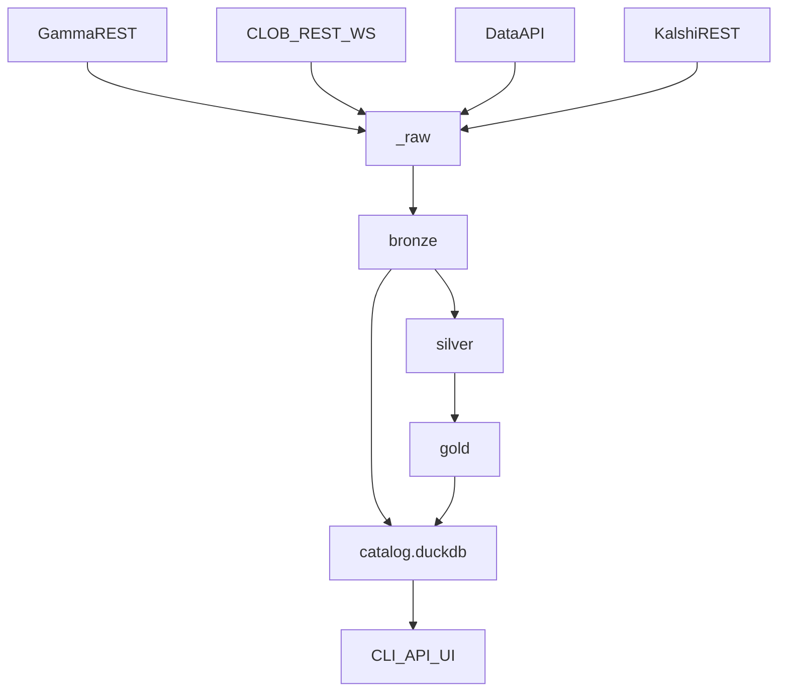

# Architecture

oddsfox is an end-to-end local data lake creator: public source APIs land in `_raw`, become bronze/silver/gold Parquet, are registered in DuckDB, and are exposed through CLI, SQL, HTTP API, and UI.
The current source implementations are Polymarket and Kalshi. Both write the same bronze tables using `source` and prefixed IDs.

## Module map

See [AGENTS.md](../AGENTS.md) for file-level responsibilities.

## Lake contract

Published at `_metadata/contract.json`. Bump `lake_contract_version()` on breaking schema changes.
