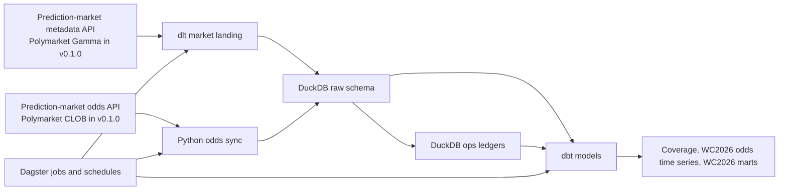
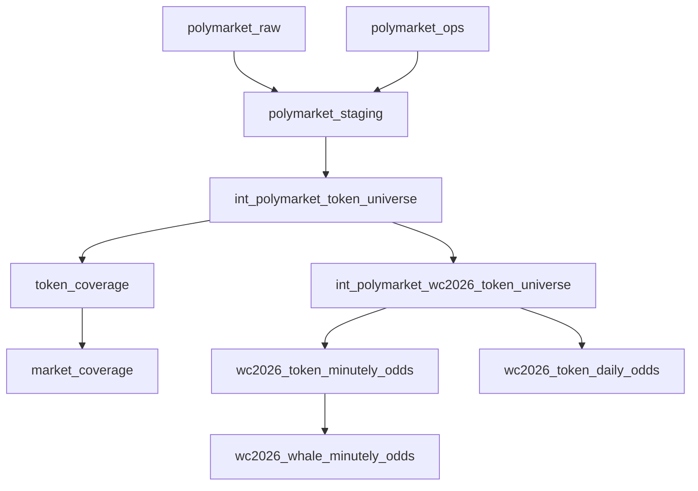

# Architecture

OddsFox is intentionally local-first: every routine workflow writes to a local
DuckDB warehouse and is coordinated by Dagster jobs that can be inspected before
schedules are enabled. The project is a prediction-market pipeline; the current
v0.1.0 adapter and marts focus on WC2026 Polymarket data.

## System Flow

Text fallback: prediction-market metadata and odds APIs feed DuckDB raw and ops
schemas. Dagster runs the ingest and dbt steps. dbt publishes local analytics
marts for coverage, health, WC2026 odds time series, and the current WC2026 market scope.

## Main Components

| Component | Responsibility |
| --- | --- |
| Dagster | Defines assets, jobs, and disabled-by-default schedules. |
| dlt | Lands market metadata and current raw/ops batches into DuckDB stage/canonical tables for the current adapter. |
| Python odds sync | Fetches odds, writes token history, and maintains ledgers. |
| DuckDB | Stores raw, ops, staging, intermediate, mart, and observability schemas. |
| dbt | Builds analytics models and data-contract tests. |

## Data Flow

Text fallback: staging normalizes raw and ops tables, intermediates establish
token universes, and marts publish token health, market coverage, full WC2026
daily and minutely odds time series, and high-volume minutely odds.

## Operating Model

- `wc2026_polymarket_full_pipeline` is the one-click full manual pipeline.
- `polymarket_minutely_odds_ingest` is the shared minutely odds job.
- Schedules are stopped by default and should stay off until manual runs pass.
- DuckDB allows one read-write writer, so scripts provide read-only inspection
  and repair paths for local operators.
