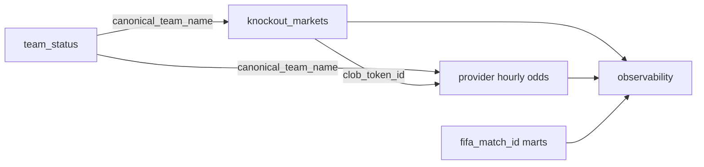

# Analysts

Use this hub when you want to query OddsFox Pipeline data, not operate it.
OddsFox Pipeline ships software and local warehouse tooling, not a hosted
dataset.

## Do You Already Have A Warehouse?

=== "Yes — open and query"

    Open the DuckDB file produced by a local or self-managed run:

    ```bash
    duckdb oddsfox.duckdb
    ```

    The default path is `oddsfox.duckdb` in the repository root. If `.env` sets
    `DUCKDB_PATH`, open that file instead. Prefer
    `duckdb.connect(..., read_only=True)` in notebooks so you do not compete
    with a writer.

    Start with [Query the warehouse](../guides/query-the-warehouse.md),
    [Query recipes](../guides/query-recipes.md), and the
    [Data dictionary](../reference/data-dictionary.md).

=== "No — need a run first"

    Ask an operator to complete [Quickstart](../getting-started/index.md) or
    [Run a scope](../guides/run-a-scope.md), then return here. Analysts do not
    need Dagster schedules or Polygon settlement history for ordinary mart
    queries.

## Query Rules

- Query `*_marts` first. These are the public analytics surfaces.
- Use `*_observability` for freshness, coverage, and trust checks.
- Treat `*_raw`, `*_ops`, staging, and intermediate schemas as internal.
- For current live analysis, prefer `is_actionable_live_market` where available,
  then inspect `current_price_status`.
- See the [Glossary](../concepts/glossary.md) for price and status semantics.

## Join Map



Practical join rules:

- Join Polymarket/Kalshi team fields to
  `international_results_wc2026_team_status.team_name` via `canonical_team_name`.
- Cross-platform and minute marts use official `fifa_match_id`. Fixture rows in
  `international_results_wc2026_matches` use `match_id`; do not assume those
  identifiers are interchangeable without a documented bridge.
- Prefer `clob_token_id` / `market_ticker` for provider time series, not raw
  question text.
- Polygon settlement reconciliation uses `condition_id` plus oriented token IDs;
  see the dictionary Polygon section when you need that path.

## Next Pages

| Goal | Page |
| --- | --- |
| Shortest query path and table chooser | [Query the warehouse](../guides/query-the-warehouse.md) |
| Copy-paste SQL and Python | [Query recipes](../guides/query-recipes.md) |
| Grain, filters, and common mistakes | [Data dictionary](../reference/data-dictionary.md) |
| Formal contract guarantees | [Data contracts](../reference/data-contracts.md) |
| Term definitions | [Glossary](../concepts/glossary.md) |
