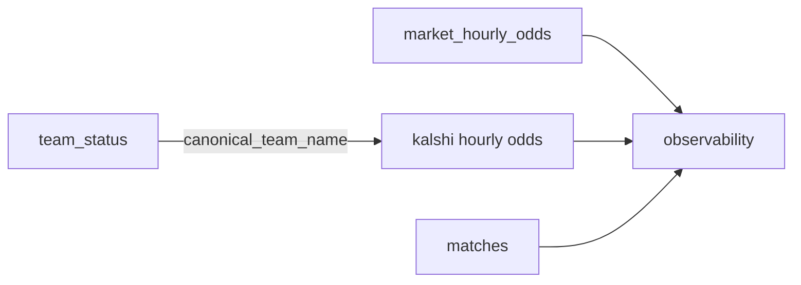

# Analysts

Use this hub when you want to query OddsFox Pipeline data, not operate it.
OddsFox Pipeline ships software and local warehouse tooling, not a hosted
dataset.

## Do You Already Have A Warehouse?

=== "Yes — open and query"

    Open the DuckDB file produced by a local or self-managed run:

    ```bash
    duckdb oddsfox.duckdb
    ```

    The default path is `oddsfox.duckdb` in the repository root. If `.env` sets
    `DUCKDB_PATH`, open that file instead. Prefer
    `duckdb.connect(..., read_only=True)` in notebooks so you do not compete
    with a writer.

    For a linear first session, start with
    [First query](../guides/first-query.md). Continue with
    [Query the warehouse](../guides/query-the-warehouse.md) for the full table
    chooser, trust rules, and query rules.

=== "No — need a run first"

    Ask an operator to complete [Quickstart](../getting-started/index.md) or
    [Run a scope](../guides/run-a-scope.md), then return here. Analysts do not
    need Dagster schedules or Polygon settlement history for ordinary mart
    queries.

## Join map


```mermaid
flowchart LR
  golden["market_hourly_odds"]
  kalshi["kalshi hourly odds"]
  teams["team_status"]
  fifa["matches"]
  obs["observability"]

  golden --> obs
  kalshi --> obs
  teams -->|"canonical_team_name"| kalshi
  fifa --> obs
```

Practical join rules:

- After a Polymarket `full` run, start from
  `polymarket_wc2026_market_hourly_odds` (see [Data dictionary](../reference/data-dictionary.md)).
- Join Kalshi team fields to `international_results_wc2026_team_status.team_name`
  via `canonical_team_name` only when that mart exists (Kalshi or match-minute
  ingest, not the default Polymarket golden path).
- Minute marts use official `fifa_match_id`. Fixture rows in
  `international_results_wc2026_matches` use `match_id`; do not assume those
  identifiers are interchangeable without a documented bridge.
- Prefer `clob_token_id` / `market_ticker` for provider time series, not raw
  question text.
- Polygon settlement reconciliation uses `condition_id` plus oriented token IDs;
  see the dictionary Polygon section when you need that path.

## Next Pages

| Goal | Page |
| --- | --- |
| Linear first session | [First query](../guides/first-query.md) |
| Shortest query path and table chooser | [Query the warehouse](../guides/query-the-warehouse.md) |
| Copy-paste SQL and Python | [Query recipes](../guides/query-recipes.md) |
| Grain, filters, and common mistakes | [Data dictionary](../reference/data-dictionary.md) |
| Formal contract guarantees | [Data contracts](../reference/data-contracts.md) |
| Term definitions | [Terminology](../reference/terminology.md) |

## See also

- [First query](../guides/first-query.md)
- [Query the warehouse](../guides/query-the-warehouse.md)
- [Query recipes](../guides/query-recipes.md)
- [Data dictionary](../reference/data-dictionary.md)
- [Analyst shortcuts](../concepts/glossary.md)
