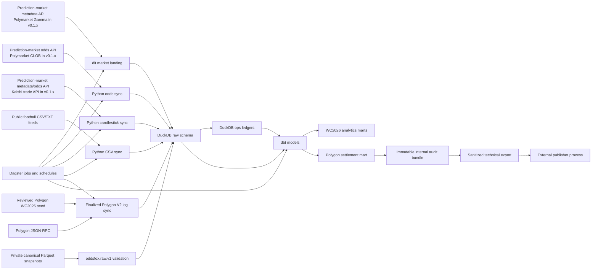
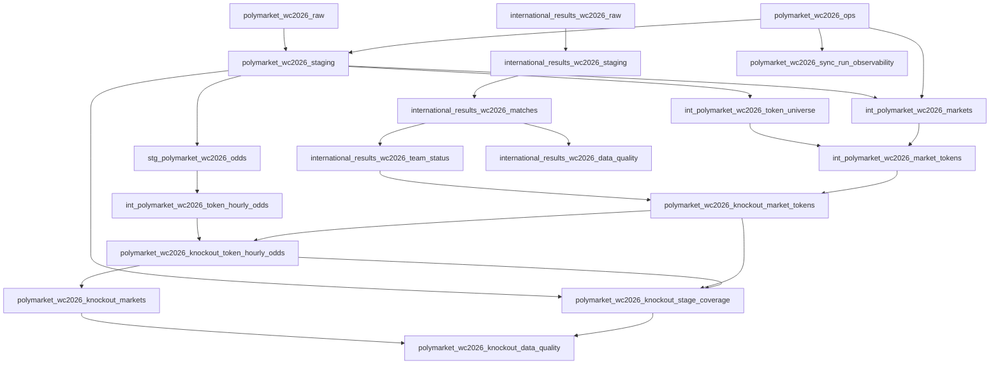

# Architecture

OddsFox Pipeline is intentionally local-first: every routine workflow writes to a local
DuckDB warehouse and is coordinated by Dagster jobs that can be inspected before
schedules are enabled. The project is a prediction-market pipeline; the current
v0.1.x adapters ship WC2026 Polymarket knockout marts, Kalshi WC2026 stage and
group-winner marts, US midterms 2026 generic market odds, public historical
international results, and the stable `wc2026.v1` strategy-input contract.

US midterms 2026 is a parallel Polymarket namespace: targeted Gamma discovery
for Balance of Power, Senate control, and House control event slugs, with raw/ops
ledgers and a simple markets-plus-hourly-odds mart. There is no FIFA join or
knockout classifier for that scope in v0.1.x.

At the generic layer, source adapters follow one shape: external market and
odds APIs feed dlt/Python ingestion, DuckDB stores raw and ops data, dbt
publishes local marts, and Dagster orchestrates the steps. Operators own the
resulting data in a local or self-managed warehouse; OddsFox Pipeline does not host a
shared dataset.

The WC2026 Polygon settlement flow is deliberately source-specific rather than
part of that generic API shape. A reviewed static manifest supplies fixture,
proposition, and token semantics; finalized Polygon V2 logs supply historical
economic settlement legs. It has no runtime Gamma/CLOB, Polymarket UI,
international-results, or OpenFootball dependency.

## System Flow

Current WC2026 implementation:

Text fallback: prediction-market metadata/odds APIs and the FIFA results CSV
feed DuckDB raw and ops schemas. Dagster runs the ingest and dbt steps. dbt
publishes local analytics marts for WC2026 knockout odds, Kalshi stage and
group-winner odds, Polygon settlement history, team scope, and ingestion
observability. The Polygon release asset writes only an internal audit bundle;
the sanitized exporter is a separate offline script. Neither path publishes or
uploads data.

The shipped Dagster/dbt graphs are fixed per scope (`wc2026`,
`us_midterms_2026`); see [Configuration](../reference/configuration.md) for the seed-backed
helper boundary.

## Main Components

| Component | Responsibility |
| --- | --- |
| Dagster | Defines assets, jobs, and disabled-by-default schedules. |
| dlt | Lands market metadata and current raw/ops batches into DuckDB stage/canonical tables for the current adapter. |
| Python CSV sync | Loads public WC2026 and 2006+ historical international-result feeds. |
| Canonical snapshot loader | Validates hashes, schemas, provenance, ordering, and transactional exactly-once loads for optional private enrichments. |
| Python odds sync | Fetches odds, writes token history, and maintains ledgers. |
| Polygon settlement sync | Scans finalized V2 logs in resumable block chunks, normalizes exact economic legs, and atomically publishes a wallet- and order-payload-redacted snapshot. |
| Polygon audit release | Writes the complete immutable local evidence bundle used for verification; it is not a sanitized publication artifact. |
| Polygon sanitized exporter | Verifies an immutable audit release, copies the allowlisted CSV byte-for-byte, and writes a redacted technical quality dossier without opening the warehouse or making network requests. |
| DuckDB | Stores raw, ops, staging, intermediate, mart, and observability schemas. |
| dbt | Builds analytics models and data-contract tests. |

## Data Flow

Text fallback: staging normalizes raw and ops tables, intermediates establish
token universes and WC2026 market scope rows, FIFA result marts provide real
team status, and Polymarket marts publish cleaned knockout progression-side
token odds plus latest knockout snapshots. Observability models publish run
metrics, stage coverage, result inference warnings, and DQ findings for
live/historical status, active-team live consumption, odds freshness, and sparse
team coverage.

### US midterms 2026

Targeted Polymarket discovery lands in `polymarket_us_midterms_2026_raw` and
`polymarket_us_midterms_2026_ops`. dbt builds a single public mart,
`polymarket_us_midterms_2026_market_token_hourly_odds`, plus run observability.
There is no `international_results` join or office-type classification in v0.1.x.

### Kalshi WC2026

Kalshi series discovery lands events and markets in `kalshi_wc2026_raw` through
dlt, maintains `kalshi_wc2026_ops.market_scope_registry`, and syncs hourly
market candlesticks into `kalshi_wc2026_raw.market_candlesticks_hourly`. dbt
builds stage and group-winner market marts plus hourly odds, coverage, and data
quality observability. Kalshi uses the public trade API; no credentials are
required for local runs.

### Polygon settlement WC2026

The developer authoring tool derives a 248-proposition manifest from pinned CC0
OpenFootball fixtures and audited Polygon event chains, then writes candidate
evidence only below ignored `artifacts/`. The runtime backfill validates the
committed seed, resolves fixed scheduled windows once, merges them by authored
V2 exchange, and transactionally publishes normalized legs after gap-free
exchange-specific coverage. The collector first scans the pinned V2 `OrdersMatched`
event, whose active token is guaranteed by the audited exchange implementation
to identify every same-condition segment, then batch-fetches only the matching
transaction receipts and finalized block headers. Complete receipt segments are
validated and normalized in memory; unrelated exchange-wide `OrderFilled`
payload is never landed. Complete leaves run concurrently with thread-local RPC
clients and one shared limiter; only the main thread writes Arrow batches and
checkpoint evidence to DuckDB. dbt produces the dense 39,120-row
proposition-minute mart.

The release job reads that valid mart and emits a complete immutable internal
audit bundle below `artifacts/polygon_settlement/audit/releases/`. That bundle
retains market identifiers and chain locators and must not be treated as a
sanitized artifact. The standalone exporter verifies an audit release and
writes **WC2026 Polygon Settlement Minute Aggregates** below
`artifacts/polygon_settlement/exports/releases/`. It copies the allowlisted main
CSV byte-for-byte and emits only redacted aggregate technical metadata.
De-identification reduces direct exposure; it does not prevent reverse-linking
sparse aggregates to the public chain. Publisher identity, dataset licensing,
legal review, and distribution are outside this repository.

## Operating Model

- `polymarket_wc2026_full_pipeline` is the one-click full manual WC2026 pipeline.
- `polymarket_us_midterms_2026_full_pipeline` is the one-click full manual US
  midterms pipeline (`tag:us_midterms_2026` dbt selection only).
- `international_results_wc2026_match_results_ingest` refreshes fixture/results
  and also runs inside the WC2026 full pipeline.
- `international_results_historical_ingest` refreshes public 2006+ matches,
  shootouts, and goalscorers; its daily schedule is stopped by default.
- `polymarket_wc2026_hourly_odds_ingest` and
  `polymarket_us_midterms_2026_hourly_odds_ingest` are the hourly odds jobs
  (`fidelity=60`).
- `kalshi_wc2026_full_pipeline` is the one-click full manual Kalshi WC2026
  pipeline (FIFA results refresh, Kalshi ingest, and `+tag:kalshi` dbt selection
  inside the combined job config).
- `kalshi_wc2026_hourly_odds_ingest` refreshes hourly Kalshi candlesticks for
  admitted registry markets.
- `polymarket_wc2026_polygon_settlement_backfill` and
  `polymarket_wc2026_polygon_settlement_release` are isolated manual jobs with
  no schedules. The release writes only the internal audit bundle. The
  sanitized exporter is standalone and unscheduled; neither path uploads data.
- Schedules are stopped by default and should stay off until manual runs pass.
- DuckDB allows one read-write writer, so scripts provide read-only inspection
  and repair paths for local operators.
