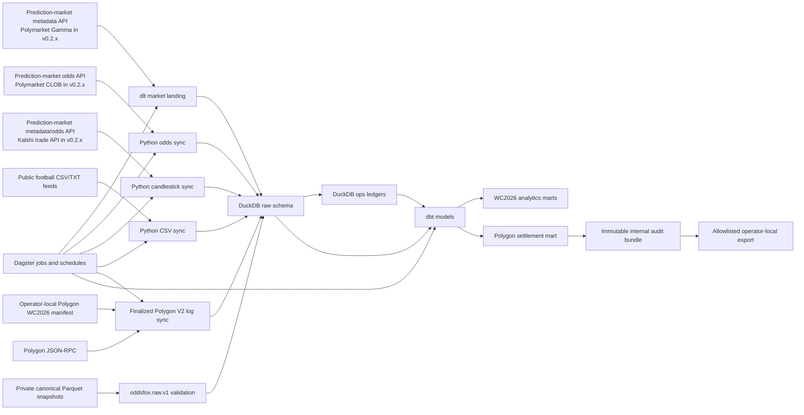

# Architecture

OddsFox Pipeline is intentionally local-first: every routine workflow writes to a local
DuckDB warehouse and is coordinated by jobs that can be inspected before
schedules are enabled. The project is a prediction-market pipeline; the current
v0.2.x adapters support WC2026 Polymarket event-gated hourly odds marts, Kalshi WC2026 stage
and group-winner marts, historical international-results ingestion, analytics
marts as the supported query API, and the private `wc2026.v1` strategy
clean-data contract.

At the generic layer, source adapters follow one shape: external market and
odds APIs feed dlt/Python ingestion, DuckDB stores raw and ops data, dbt
publishes local marts, and Dagster orchestrates the steps. Operators supply and
control the data in a local or self-managed warehouse; OddsFox Pipeline does not
host datasets.

The WC2026 Polygon settlement pipeline is deliberately source-specific rather
than part of that generic API shape. A complete operator-local manifest supplies
fixture, proposition, and token semantics; finalized Polygon V2 logs supply
historical economic settlement legs. It has no runtime Gamma/CLOB, Polymarket UI,
international-results, or OpenFootball dependency.

## System path

Current WC2026 implementation:

```mermaid
flowchart LR
    gamma["Prediction-market metadata API<br/>Polymarket Gamma in v0.2.x"] --> dlt["dlt market landing"]
    clob["Prediction-market odds API<br/>Polymarket CLOB in v0.2.x"] --> odds["Python odds sync"]
    kalshi_api["Prediction-market metadata/odds API<br/>Kalshi trade API in v0.2.x"] --> kalshi_sync["Python candlestick sync"]
    results["Public football CSV/TXT feeds"] --> result_sync["Python CSV sync"]
    seed["Operator-local Polygon WC2026 manifest"] --> polygon_sync["Finalized Polygon V2 log sync"]
    polygon_rpc["Polygon JSON-RPC"] --> polygon_sync
    private["Private canonical Parquet snapshots"] --> validate["oddsfox.raw.v1 validation"]
    dlt --> raw["DuckDB raw schema"]
    odds --> raw
    kalshi_sync --> raw
    result_sync --> raw
    polygon_sync --> raw
    validate --> raw
    raw --> ops["DuckDB ops ledgers"]
    raw --> dbt["dbt models"]
    ops --> dbt
    dbt --> marts["WC2026 analytics marts"]
    dbt --> polygon_mart["Polygon settlement mart"]
    polygon_mart --> audit["Immutable internal audit bundle"]
    audit --> export["Allowlisted operator-local export"]
    dagster["Dagster jobs and schedules"] --> dlt
    dagster --> odds
    dagster --> kalshi_sync
    dagster --> result_sync
    dagster --> polygon_sync
    dagster --> dbt
```

Text fallback: prediction-market metadata/odds APIs and the FIFA results CSV
feed DuckDB raw and ops schemas. Dagster runs the ingest and dbt steps. dbt
publishes local analytics marts for WC2026 Polymarket hourly odds, Kalshi stage and
group-winner odds, Polygon settlement history, team scope, and ingestion
observability. The Polygon release asset writes only an internal audit bundle;
the allowlisted exporter is a separate offline script. Neither path uploads
data.

The shipped Dagster/dbt graphs are fixed per scope (`wc2026` on Polymarket and
Kalshi); see [Configuration](../reference/configuration.md) for the seed-backed
helper boundary.

## Main Components

| Component | Responsibility |
| --- | --- |
| Dagster | Defines assets, jobs, and disabled-by-default schedules. |
| dlt | Lands market metadata and current raw/ops batches into DuckDB stage/canonical tables for the current adapter. |
| Python CSV sync | Loads public WC2026 and 2006+ historical international-result feeds. |
| Canonical snapshot loader | Validates hashes, schemas, provenance, ordering, and transactional exactly-once loads for optional private enrichments. |
| Python odds sync | Fetches odds, writes token history, and maintains ledgers. |
| Polygon settlement sync | Scans finalized V2 logs in resumable block chunks, normalizes exact economic legs, and atomically publishes a wallet- and order-payload-redacted snapshot. |
| Polygon audit release | Writes the complete immutable local evidence bundle used for verification; it contains internal identifiers and locators. |
| Polygon technical exporter | Verifies an immutable audit release, copies the allowlisted CSV byte-for-byte, and writes a redacted operator-local quality dossier without opening the warehouse or making network requests. |
| DuckDB | Stores raw, ops, staging, intermediate, mart, and observability schemas. |
| dbt | Builds analytics models and data-contract tests. |

## Data Flow

```mermaid
flowchart TD
    subgraph polymarketGolden [Polymarket golden mart]
        raw["polymarket_wc2026_raw"] --> staging["polymarket_wc2026_staging"]
        ops["polymarket_wc2026_ops"] --> staging
        staging --> token_working_set["int_polymarket_wc2026_token_working_set"]
        staging --> wc2026_markets_int["int_polymarket_wc2026_markets"]
        staging --> event_latest["int_polymarket_wc2026_event_latest"]
        staging --> odds["stg_polymarket_wc2026_odds"]
        event_latest --> wc2026_markets_int
        ops --> wc2026_markets_int
        wc2026_markets_int --> primary_token["int_polymarket_wc2026_primary_market_token"]
        odds --> hourly_fact["int_polymarket_wc2026_token_hourly_odds"]
        primary_token --> golden["polymarket_wc2026_market_hourly_odds"]
        wc2026_markets_int --> golden
        hourly_fact --> golden
        ops --> observability["polymarket_wc2026_ingestion_run_observability"]
    end
    subgraph internationalResults [Kalshi and match-minute only]
        results_raw["international_results_wc2026_raw"] --> results_staging["international_results_wc2026_staging"]
        results_staging --> matches["international_results_wc2026_matches"]
        matches --> team_status["international_results_wc2026_team_status"]
        matches --> results_dq["international_results_wc2026_data_quality"]
    end
```

Text fallback: the Polymarket golden mart path normalizes raw and ops tables, the registry admits
sticky event-volume-eligible WC2026 markets, intermediates establish token
working sets and primary tokens (Yes preferred, else `outcome_index` 0), and the golden
`polymarket_wc2026_market_hourly_odds` mart publishes full-lifetime hourly
primary-outcome odds with `primary_outcome_label` and comprehensive market and event metadata. Observability
models publish run metrics. `international_results_wc2026_*` marts are built on
Kalshi and match-minute paths only, not the Polymarket golden-mart closure.

### Kalshi WC2026

Kalshi series discovery lands events and markets in `kalshi_wc2026_raw` through
dlt, maintains `kalshi_wc2026_ops.market_scope_registry`, and syncs hourly
market candlesticks into `kalshi_wc2026_raw.market_candlesticks_hourly`. dbt
builds stage and group-winner market marts plus hourly odds, coverage, and data
quality observability. Kalshi uses the public trade API; no credentials are
required for local runs.

### Polygon settlement WC2026

The developer authoring tool derives a 248-proposition candidate manifest from pinned CC0
OpenFootball fixtures and audited Polygon event chains, then writes candidate
evidence only below ignored `artifacts/`. The runtime backfill validates the
complete local seed, resolves fixed scheduled windows once, merges them by authored
V2 exchange, and transactionally publishes normalized legs after gap-free
exchange-specific coverage. The collector first scans the pinned V2 `OrdersMatched`
event, whose active token is guaranteed by the audited exchange implementation
to identify every same-condition segment, then batch-fetches only the matching
transaction receipts and finalized block headers. Complete receipt segments are
validated and normalized in memory; unrelated exchange-wide `OrderFilled`
payload is never landed. Complete leaves run concurrently with thread-local RPC
clients and one shared limiter; only the main thread writes Arrow batches and
checkpoint evidence to DuckDB. dbt produces the dense 39,120-row
proposition-minute mart.

The release job reads that valid mart and emits a complete immutable internal
audit bundle below `artifacts/polygon_settlement/audit/releases/`. That bundle
retains market identifiers and chain locators and is internal-only. The
standalone exporter verifies an audit release and writes the operator-local
**WC2026 Polygon Settlement Minute Aggregates** dossier below
`artifacts/polygon_settlement/exports/releases/`. It copies the allowlisted main
CSV byte-for-byte and emits only redacted aggregate technical metadata.
De-identification reduces direct exposure; it does not prevent reverse-linking
sparse aggregates to the public chain. The repository does not upload the
result or determine rights in operator inputs or outputs.

## Operating Model

The `polymarket:soccer` branch is a first-class sibling of WC2026. Gamma exact
tag scans land append-only event, tag, membership, and market snapshots in
`polymarket_soccer_raw`; a strict current projection in
`polymarket_soccer_ops.match_result_registry` supplies exact six-token match
windows to the shared minute fetch and immutable snapshot engine. dbt filters
publication through the current registry and latest successful exact-window
audit before producing sparse and dense marts. No external results provider or
manual mapping input crosses this branch.

A soccer-only preflight and run ledger wrap this branch. Dagster blocking checks
protect catalog, registry, and publication invariants; local dbt views derive
current health, alerts, and consecutive-success trends. `scripts/run_health.py`
is the nonzero automation boundary. Monitoring stays inside DuckDB, Dagster,
and structured local logs and introduces no hosted alerting dependency.

- `polymarket_wc2026_full_pipeline` is the one-click full manual WC2026 pipeline
  (registry, hourly odds, and golden-mart dbt only).
- `international_results_wc2026_match_results_ingest` refreshes fixture/results
  for Kalshi and match-minute pipelines; it is not part of the Polymarket full
  pipeline.
- `international_results_historical_ingest` refreshes public 2006+ matches,
  shootouts, and goalscorers; its daily schedule is stopped by default.
- `polymarket_wc2026_hourly_odds_ingest` is the manual Polymarket odds job
  (`fidelity=60`); it has no Dagster schedule.
- `kalshi_wc2026_full_pipeline` is the one-click full manual Kalshi WC2026
  pipeline (FIFA results refresh, Kalshi ingest, and `+tag:kalshi` dbt selection
  inside the combined job config).
- `kalshi_wc2026_hourly_odds_ingest` refreshes hourly Kalshi candlesticks for
  admitted registry markets.
- `polymarket_wc2026_polygon_settlement_backfill` and
  `polymarket_wc2026_polygon_settlement_release` are isolated manual jobs with
  no schedules. The release writes only the internal audit bundle. The
  technical exporter is standalone and unscheduled; neither path uploads data.
- Schedules are stopped by default and should stay off until manual runs pass.
- DuckDB allows one read-write writer, so scripts provide read-only inspection
  and repair paths for local operators.
