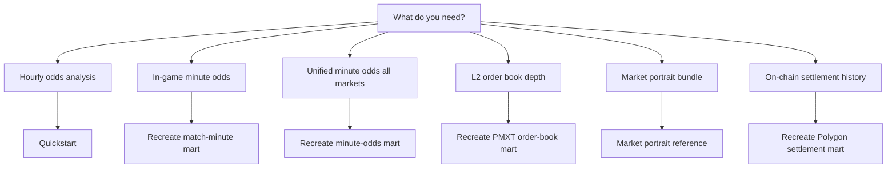

# Advanced pipelines

Operator

Use this page when you need an isolated WC2026 path beyond the ordinary
Polymarket or Kalshi hourly quickstart. Ordinary hourly analysis does not
require these pipelines.

## Choose a path

| Pipeline | Maturity | Entry | Guide |
| --- | --- | --- | --- |
| Polymarket / Kalshi hourly | Production | `scripts/run_scope.py` | [Quickstart](../getting-started/index.md); [Choose a scope](../getting-started/choose-a-scope.md) |
| Match-minute odds | Mature, isolated | `polymarket_wc2026_match_minute_odds_backfill` | [Recreate match-minute mart](recreate-match-minute-mart.md) |
| Minute odds (unified) | Mature, isolated | `polymarket_wc2026_minute_odds_backfill` | [Recreate minute-odds mart](recreate-minute-odds-mart.md) |
| Match order book | Mature, isolated | `polymarket_wc2026_match_order_book_backfill` | [Recreate PMXT order-book mart](recreate-match-order-book-mart.md) |
| Market portrait | Mature, isolated | `polymarket_wc2026_market_portrait_backfill` | [Market portrait](../reference/market-portrait.md) |
| Polygon settlement | Mature, isolated | `polymarket_wc2026_polygon_settlement_backfill` | [Recreate Polygon settlement mart](recreate-polygon-settlement-mart.md) |

Shared setup for match-minute and Polygon rebuilds (SSD layout, runtime dirs,
operator-local seeds) lives in
[Recreate local marts](recreate-local-marts.md). Entry jobs, CI dbt gates, and
maturity definitions live in the
[Pipeline registry](../reference/orchestration.md#pipeline-registry).

## Credentials and operator-local inputs

| Pipeline | Network / credentials | Operator-local inputs |
| --- | --- | --- |
| Match-minute odds | Live APIs or completed raw warehouse | Populated schedule overlay (tracked shell) |
| Minute odds (unified) | Live APIs or completed raw warehouse | Same schedule overlay as match-minute |
| Match order book | Live APIs or completed raw warehouse; PMXT API key | Reviewed target manifest for match 95 |
| Market portrait | Completed order-book + trades scan; PMXT API key | Reviewed `TARGET_MANIFEST` for one approved match |
| Polygon settlement | Finalized-capable Polygon JSON-RPC | Reviewed 248-row manifest + resolution attestation (tracked seed is a header-only shell) |

Never commit `.env`, operator seed rows, reviewed attestations, DuckDB files, or
exports. See [Operator responsibilities](../concepts/operator-responsibilities.md).

## Explicit non-goals

- These paths are **not** `run_scope.py` chooser refs (`polymarket:wc2026`,
  `kalshi:wc2026`).
- Ordinary `dbt-build-ci` excludes isolated tags such as
  `tag:polygon_settlement`, `tag:pmxt_order_book`, and `tag:minute_odds`; use the
  dedicated `dbt-*-ci` Make targets listed in the
  [Pipeline registry](../reference/orchestration.md#pipeline-registry).
- Polygon audit bundles and technical exports are not `wc2026.v1` signal
  inputs and must not feed intents or execution. See
  [Integrators](../audiences/integrators.md).

## See also

- [Operators](../audiences/operators.md)
- [Run a scope](run-a-scope.md)
- [Validate and recover](validate-and-recover.md)
- [Orchestration reference](../reference/orchestration.md)
- [Data contracts](../reference/data-contracts.md)
