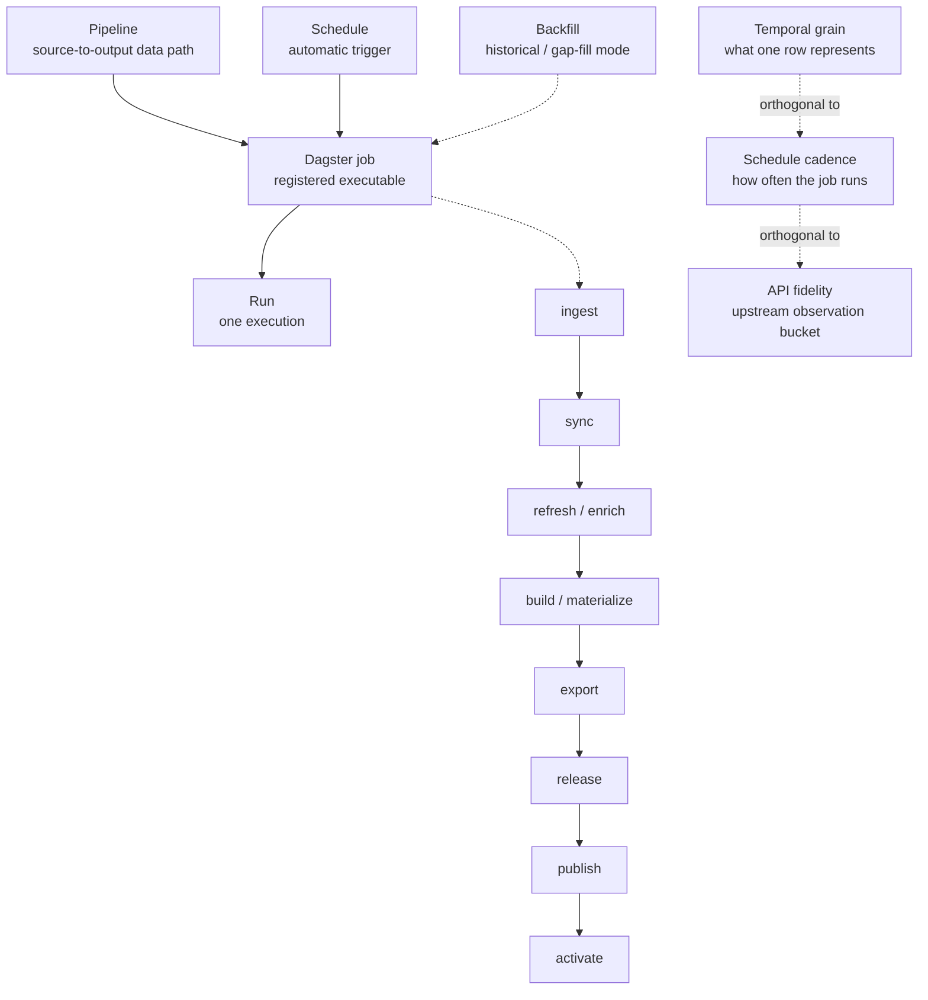
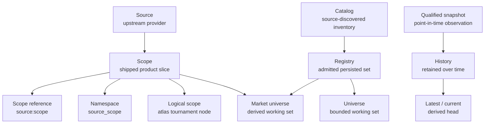
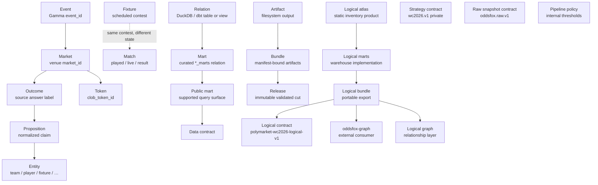

# Terminology

Normative vocabulary for OddsFox Pipeline. Identifier construction lives in
[Naming](naming.md). Short analyst and operator shortcuts live in the
[Glossary](../concepts/glossary.md).

This page defines what words mean. Breaking identifier renames and prose
cleanup follow these definitions. There are no compatibility aliases in
`v0.1.x`; operators with older warehouses delete `oddsfox.duckdb*` and rebuild.

## Taxonomy map

How the terms below relate. Each section table is normative; these diagrams
are the visual index.

### Execution stack

### Identity and inventory

### Domain, outputs, and contracts

## Orchestration ladder

| Term | Meaning | Example |
| --- | --- | --- |
| **Pipeline** | A coherent source-to-output data path. | Polymarket WC2026 match-minute odds pipeline |
| **Dagster job** | The registered executable that runs part or all of a pipeline. | `polymarket_wc2026_match_minute_odds_backfill` |
| **Run** | One execution of a job. | A Dagster run of the hourly odds job |
| **Schedule** | An automatic trigger for a job. | Hourly odds schedule (stopped by default) |
| **Backfill** | Historical or gap-filling execution mode for a pipeline. | Match-minute odds backfill |

Do not use **flow** for a product path or job. Use **pipeline** for the data
path and **job** / **run** for execution. Jobs named `*_full_pipeline` remain
valid identifiers: they execute a complete pipeline for a scope.

Qualify third-party pipeline objects: say **dlt pipeline** for `dlt.pipeline()`,
and **OddsFox Pipeline** for this repository/product.

## Grain and cadence

| Term | Meaning |
| --- | --- |
| **Temporal grain** | What one row uniquely represents. Prefer “minute-grain” or “hourly-grain.” |
| **Schedule cadence** | How often a job is intended to run. |
| **API fidelity** | Upstream observation bucket (for example CLOB `fidelity=60`). |

Never use **minutely**. A match-minute pipeline has minute temporal grain; it
is not necessarily executed every minute.

## Identity

| Term | Meaning | Example |
| --- | --- | --- |
| **Source** | Upstream provider adapter. | `polymarket`, `kalshi` |
| **Scope** | Fixed shipped product slice within a source. | `wc2026` |
| **Scope reference** | Chooser string `source:scope`. | `polymarket:wc2026` |
| **Namespace** | Flat identifier prefix `source_scope`. | `polymarket_wc2026` |
| **Logical scope** | Tournament/stage/group/fixture/award node in the logical atlas. | `scope_id` in `polymarket_wc2026_logical_scopes` |
| **Market universe** | Derived bounded set of markets or tokens for one pipeline. | Match-minute admitted markets |

Do not shorten **logical scope** or **market universe** to bare **scope**.

## Catalog, registry, universe

| Term | Meaning |
| --- | --- |
| **Catalog** | Source-discovered inventory. Qualify: **market catalog** or **event catalog**. |
| **Registry** | Admitted persisted set the pipeline operates on. Qualify: **market scope registry**. |
| **Universe** | Derived bounded working set built from a registry or catalog. |

Never say “the catalog” or “the registry” without the grain qualifier.

## Observation state

| Term | Meaning |
| --- | --- |
| **Snapshot** | Point-in-time observation. Always qualify (registry snapshot, catalog snapshot, order-book snapshot, canonical raw snapshot). |
| **History** | Retained observations over time. |
| **Latest** / **current** | Derived current head of that history. |

Bare “snapshot” is forbidden in new prose.

## Operation verbs

| Verb | Use when |
| --- | --- |
| **Ingest** | Land external data into raw storage through a routine job. |
| **Sync** | Reconcile local state with a source (implementation-level). |
| **Refresh** | Update a current snapshot or registry from already-discovered inputs. |
| **Enrich** | Fill missing metadata on already-admitted rows. |
| **Build** | Materialize dbt models. |
| **Materialize** | Produce a specific asset or relation. |
| **Export** | Serialize warehouse data to operator-local files. |
| **Release** | Emit an immutable, validated, versioned cut. |
| **Publish** | Make a validated cut available to a consumer path. |
| **Activate** | Repoint “current” to a published release. |

**Enrich** replaces metadata “backfill” when the work is not historical
gap-filling. Keep **backfill** for historical jobs such as match-minute,
order-book, and Polygon settlement.

## Warehouse and artifacts

| Term | Meaning |
| --- | --- |
| **Relation** | Any DuckDB/dbt table or view. |
| **Mart** | Curated consumer-facing relation in a `*_marts` schema. |
| **Public mart** | Supported warehouse query surface documented in [Data contracts](data-contracts.md). “Public” does not mean redistributable. |
| **Artifact** | Filesystem output outside the warehouse. |
| **Bundle** | Manifest-bound collection of artifacts. |
| **Release** | Validated immutable version of a bundle or export set. |

## Domain hierarchy

Polymarket / logical atlas:

| Term | Grain |
| --- | --- |
| **Event** | Gamma event container (`event_id`). |
| **Market** | Venue market (`market_id`). |
| **Outcome** | Source-provided answer label. |
| **Token** | Tradable CLOB side (`clob_token_id`). |
| **Proposition** | Normalized claim parsed from an outcome. |
| **Entity** | Canonical team, player, fixture, group, stage, award, or tournament node. |

FIFA schedule terms:

| Term | Meaning |
| --- | --- |
| **Fixture** | Scheduled contest and schedule identity (`fifa_match_id`). |
| **Match** | The contest in its played, live, or result state. |
| **Test fixture** | Synthetic CI or unit-test input. Always say “test fixture.” |

Preserve upstream Gamma fields such as `game_id` and `game_start_time`
verbatim. Derived first-party fields use **match_*** names.

## Graph

| Term | Meaning |
| --- | --- |
| **oddsfox-graph** | External consumer repository and dashboard product. |
| **Logical graph** | Relationship layer built from the logical bundle. |
| **dbt graph** / **asset graph** | Tooling dependency graphs. Always qualify. |

Do not use bare “graph” for the logical atlas, bundle, or export. Prefer
**logical atlas**, **logical bundle**, or **logical contract**.

## Contract

| Term | Meaning |
| --- | --- |
| **Data contract** | Public mart guarantees in [Data contracts](data-contracts.md). |
| **Strategy contract (`wc2026.v1`)** | Private clean-data relation set for strategy consumers. |
| **Logical contract (`polymarket-wc2026-logical-v1`)** | Portable seven-file logical bundle schema. |
| **Raw snapshot contract (`oddsfox.raw.v1`)** | Private collector publish format. |
| **Pipeline policy** | Internal threshold and window seed used by dbt/Python (`*_pipeline_policy`). |

Never call `wc2026.v1` the public analytics contract. Public marts are the
supported query API; `wc2026.v1` is the private strategy surface.

## Logical atlas chain

| Term | Layer |
| --- | --- |
| **Logical atlas** | Static WC2026 inventory product (admission, semantics, review). |
| **Logical marts** | Warehouse implementation (`polymarket_wc2026_logical_*`). |
| **Logical bundle** | Versioned portable export consumed by `oddsfox-graph`. |

The logical atlas intentionally contains no odds.

## Membership

| Term | Meaning |
| --- | --- |
| **Structural membership** | Current `(market_id, event_id)` links. |
| **Reviewed membership** | Operator inclusion/exclusion decisions. |
| **Membership class** | Review taxonomy bucket (`sporting`, `qualification`, …). |

## Raw

| Term | Meaning |
| --- | --- |
| **Raw layer** | Warehouse schema layer `*_raw`. |
| **Raw price** | Unadjusted observed close. |
| **Raw snapshot** | Private `oddsfox.raw.v1` publish. |

Never use bare “raw” in integrator docs.

## Frozen exceptions

These names stay as written:

- Product and package: `OddsFox Pipeline`, `oddsfox_pipeline`, `oddsfox-pipeline`
- Library API: `dlt.pipeline`
- External product: `oddsfox-graph`
- Qualified tooling: `dbt graph`, `asset graph`, Dagster asset graph
- Vendor fields: Gamma `game_id`, `game_start_time`, and similar upstream columns
- Test infrastructure: “test fixture”, pytest fixtures
- Released CHANGELOG history (do not rewrite old release notes)
- Historical filesystem roles already documented for Polygon audit bundles

## Deprecated phrases

| Avoid | Prefer |
| --- | --- |
| flow (product path) | pipeline |
| minutely | minute-grain / match-minute |
| graph odds / graph export / graph bundle | logical atlas / logical bundle |
| graph contract (internal) | logical contract |
| public `wc2026.v1` | strategy contract `wc2026.v1` |
| bare snapshot | qualified snapshot |
| bare catalog / registry | market catalog / event catalog / market scope registry |
| metadata backfill (non-historical) | metadata enrichment |
| pipeline run events (ops telemetry) | ingestion run events |
| sync run observability | ingestion run observability |
| scope class (review taxonomy) | membership class |
| knockout fixtures (matches 1–104) | schedule fixtures |

## See also

- [Naming](naming.md)
- [Glossary](../concepts/glossary.md)
- [Orchestration](orchestration.md)
- [Data contracts](data-contracts.md)
- [Strategy contracts](strategy-contracts.md)
- [Build the WC2026 logical atlas](../guides/build-wc2026-logical-atlas.md)
